# OOP C#

- [Objekte](#objekte)
- [Klassen](#Klassen)
- [Methoden](#methoden)
- [Attribute](#attribute)
- [Klassen, Attribute, Methoden und Objekte im UML](#klassen-attribute-methoden-und-objekte-im-uml)
- [Instanzvariabeln](#instanzvariabeln)
- [Attribute UML](#attribute-uml)
- [Kapselung](#kapselung)
- [Objekt Instanzierung und Konstruktoren](#objekt-instanzierung-und-konstruktoren)
- [Konstruktoren UML](#konstruktoren-uml)
- [Vererbung](#vererbung)
- [Collections](#collections)
- [Assoziatonen](#assoziatonen)
- [Polymorphus](#polymorphus)
- [UML Sequnezdiagramme](#uml-sequenzdiagramme)

> Alle Inhlate sind vom Modul 320 von der BBB 

## Objekte
Inhalt von: Files PR 4200-4201 und LA 4200-4202

> Ein Objekt ist eine softwaretechnische Repräsentation eines realen oder erdachten, klar abgegrenzten Gegenstands oder Begriffs. Das Objekt erfasst alle Aspekte des Gegenstandes durch Attribute (=Eigenschaften) und Methoden.

Aus Klassen kann man einzelne Objekte erstellen.

Bsp.: Wenn man die Klasse Auto hat mit den Attributen Farbe und Name kann man diese Klasse gebrauchen und daraus einen Objekt erstellen. Unser Objekt hat die Attributwerte für Name = Autoname und Farbe = Rot. Die vordefinierten Methoden sagen dann, was dieses Auto machen kann.

## Klassen
Inhalt von: Files PR 4200-4201 und LA 4200-4202

> Unter einer Klasse versteht man die softwaretechnische Beschreibung eines Bauplanes für ein Objekt. Aus einer Klasse können dann Objekte abgeleitet (gebildet, instanziiert) werden.

Bsp.: Klasse: Autos

Diese Klasse beinhaltet Attribute wie Farbe und Name, sowie Methoden, also was das Auto überhaupt macht.

## Methoden
Inhalt von: Files PR 4205 und LA 4206-4207

> Methoden beschreiben die Operationen, die mit dem Objekt bzw. seinen Attributen durchgeführt werden können.

Die Methoden beschreiben was das Objekt genau tut. Wenn ich also ein Auto habe könnte ich eine Methode erstellen, der zum Beispiel die Geschwindigkeit des Autos berechnet. Oder eine einfachere Methode, der dem Benutzer erlaubt, den Namen des Autos zu setzen.

Methoden können sich gegenseitig aufrufen oder von aussen aufgerufen werden.

Aufbau: Sichtbarkeit + Rückgabewert + Methodename + Parameter

Bsp.: public string Hallo (string idk){}

public = Sichtbarkeit, string = Rückgabewert, Hallo = Methodename, (string idk) = Parameter

Wenn man keine Rückgabe braucht kann man anstatt string "void" schreiben, bei den Parametern kann man die Klammern leer lassen oder mehrere Parameter einfügen.

Code zwischen geschweiften Klammern ist das Eigentliche, was die Methode tut.

```csharp
//beispiel methode

public string Hallo (string name)
{
   //return bricht die Funktion ab und gibt einen Wert zurück
   return "Hallo " + name + " !";
}

public void Hi ()
{
    //es können auch andere Methoden aufgerufen werden
    Console.WriteLine("Hi");
}

//es kann innerhalb den geschweiften Klammern auch auf die Attribute zugegriffen werden
```

Methoden aufrufen:

Hund huendchen = new
Hund();

huendchen.Belle(10);

Belle ist die Methode, 10 ist das Argument.

### Methodenüberladung

Gleich wie bei der Überladung von Konstruktoren können auch Methoden überladen werden. Wenn innerhalb einer Klasse mehrere Methoden mit gleichem Methodennamen existieren, werden diese Methoden als Überladungen bezeichnet (engl. Overload).Überladung bei Methoden passiert gleichwie bei Kosntruktoren durch unterschiedliche Parameterlisten. Es gibt drei Varianten:

* Die Anzahl
  der Parameter sind verschieden.
* Die Datentypen
  der Parameter sind verschieden.
* Bei mehreren Parametern mit
  unterschiedlichen Datentypen ist die Reihenfolge
  der Parameter verschieden.

Methodenname, Sichtbarkeitsmodifikator und Rückgabewert dürfen dabei nicht verändert werden, sondern sind immer gleich

## Attribute
Inhalt von: Files PR 4200-4201 und LA 4200-4202
> Attribute sind Eigenschaften des Objektes. Sie beschreiben den Gegenstand vollständig. Attribute sind geschützt gegen Manipulation von aussen (das nennt man Kapselung).

In einer Klasse hat es Attribute, die bestimmen was diese Klasse genau ist. Mit dem bsp. mit dem Auto sind der Name und die Farbe des Autos Attribute. Die Attributenwerte ändern sich je nach Objekt. Also im bsp. mit dem Auto Objekt wäre der Attribut Farbe und der Attributenwert Rot.

## Klassen, Attribute, Methoden und Objekte im UML
Inhalt von: Files PR 4200-4201 und LA 4200-4202

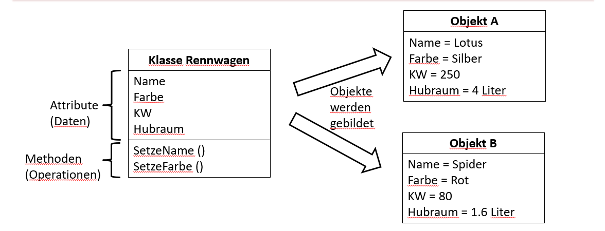

## Instanzvariabeln
Inhalt von: Files PR 4202 und LA 4203-4204
> Instanzvariablen sind Variablen, welche eindeutig einer Instanz (= Objekt) zugeordnet sind und deren Gültigkeit auf
> diese Instanz begrenzt ist.

### Felder

> Speichern Daten eines Objekts, welche in mehr als einer Methode oder für längere Zeit benötigt werden.

* Private, Protected oder Public
* Automatisch: Private
* Zur Unterscheidung von Eigenschaften werden sie meistens mit _ und klein geschrieben

```csharp
//Beispiele

private string _name;
private string _geheimdienst = "M16";
private readonly int _geburtsjahr;
```

### Eigenschaften

> Ermöglichen Lesen, Schreiben und Berechnen von Werten auf flexible und dennoch einfache Weise.

* meistens public
* ähnlicher zu Methoden
* Sichtbarkeitsmodifikator, Bezeichner und Accessors
* Zugriffsmodifizierer können einzeln oder im Gesamten deklariert werden
* gross und ohne _ geschrieben

hafkjadfc

#### Accessors

```csharp
//beispiele Accessors

public string Waffe { get; }
public string Augenfarbe { get; init; }
public int IDNummer { get; set; }

//beispiele selbsprogrammierte get-Accessors

//in diesem Beispiel wäre _geburtsdatum ein Backing Field
private DateTime _geburtsdatum;
public int Alter
{
    //dieser get accessor ist jetzt selbst programmiert
   get
   {
      return DateTime.Now.Year - _geburtsdatum.Year;
   }
}

//beispiele selbstprogrammierte set-Accessors

//in diesem Beispiel wäre _gesundheitszustand ein Backing Field
private string _gesundheitzustand;
public int Hitpoints
{
   //dieser set accessor ist jetzt selbst programmiert
   set
   {
      if(value == 100)
      {
          _gesundheitzustand = "gut";
      }
      else
      {
         _gesundheitzustand = "schlecht";
      }
   }
}

//kurzschreibweise (expression body)

get => _geldindollar;
set => _geldindollar = value;
```

##### Get:

* für den lesenden
* nur get = read-only

##### Set:

* für den schreibenden
* kann nicht zusammen mit init verwendet werden
* nur set = write-only
* get und set = read-write

##### Init:

* setzt Werte bei Erstellung des Objekts
* kann nicht zusammen mit set verwendet werden

### Backing Fields

> Die privaten Felder, die hinter einem selbst geschriebenen Accessor stehen, nennt man «Backing Fields» (ungefähr «Unterstützungsfeld»).

* für effektives Speichern der Daten
* die Eigenschaft mit selbstgeschriebenen Accessors bietet spezielle Zugriffe auf die Felder

```csharp
//beispiel Backing Fields

private const float kursDollarZuPfund = 0.74f;
//das Backing Field ist _geldindollar
private int _geldindollar;
public int GeldInPfund
{
   //jeder lesende Zugriff hat aus Dollar in die richtige Währung gerechnet
   get
   {
       return (int)(_geldindollar * kursDollarZuPfund);
   }
   //in jedem schreibendem Zugriff wird auch von Dollar umgerechnet
   set
   {
      _geldindollar = (int)(value / kursDollarZuPfund);
   }
}

//zur Kommunikation sollte immer der Ansatz "Backing Field + Property" verwenden
```

## Attribute UML
Inhalt von: Files PR 4200-4201 und LA 4200-4202

* "+" = public
* "-" = private
* "property" = Eigenschaft
* Datentyp = Hinter dem Doppelpunkt

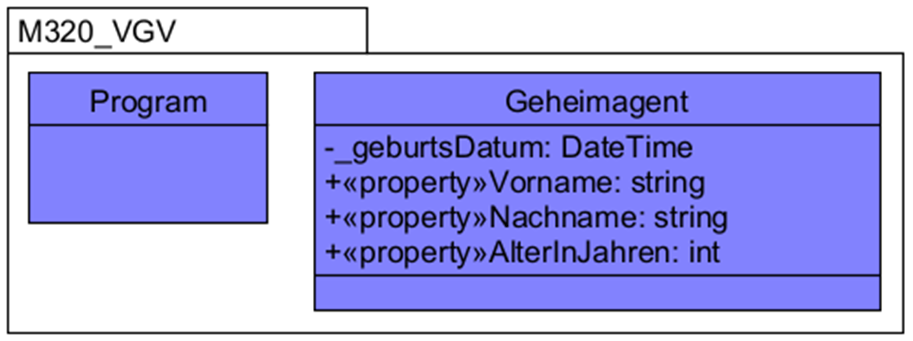

## Kapselung
Inhalt von: Files PR 4203 und LA 4213

> Das Prinzip der Kapselung besagt, dass die Daten und Informationen vor dem Zugriff von aussen geschützt oder verborgen werden. Der direkte Zugriff wird auf den Member des Objektes verhindert. DatenStrukturen und Algorithmen innerhalb einer Klasse werden von ausserhalb "versteckt". Also: Die Klasse kümmert sich um das Speichern und um die Berechnungen. Stattdessen existiert eine definierte Schnittstelle (eng. Interface), welche die verschiedenen Zugriffsmöglichkeiten regelt.

Bsp.: Müdigkeit eines Agenten. Man will nicht, dass alle sehen, wie müde der Agent ist. Sie kann auch von niemanden direkt beeinflusst werden. Jedoch existiert eine Schnitstelle die "lesenden" und "schreibenden" zu Müdigkeit ermöglicht.

Lesender:

* Müdigkeit kann vom Verhalten und von der mentalen Abwesenheit erkannt werden

Schreibender:

* Dem Geheimagenten zu sagen, dass er nicht mehr müde sein soll hat keinen Effekt.
* Man kann ihn aber dazu bringen, nach aussen eine Schnittstelle anzubieten, mit dem er die Müdigkeit verändern kann (schlafen = weniger Müdigkeit, anstrengen = mehr Müdigkeit)

Begründung:

* Für einen direkten Zugriff müstte man alles Interne wissen (darf die Müdigkeit unter 0 gehen etc.)
* Verwaltung der Attribute sollte dem Objekt selber überlassen sein (es ist dem Agent selber überlassen, wie viel Müdigkeit er verliert wenn er schläft etc.)
* Die Implementierung der Datenstrukturen und Algorithmen werden von aussen in einer Kapsel "versteckt" (wenn man die Berechnungen für Müdigkeit ändern sollte dies nur in der Zugehörigen Klasse gemacht werden, die anderen Klassen sollten davon "nichts erfahren")

### Sichtbarkeit

Hauptsächlich verwenden wir public (können von anderen Objekten aufgerufen werden) und private (können nur vom eigenen Objekt aufgerufen werden), selten auch protected (die eigene Klasse und Kindklassen haben Zugriff).

> Private für:
>
> Vermeiden von kopiertem Code, Vermeiden von zu langen Methoden, Vermeiden von Methoden, die mehr als eine Verantwortung haben, Auslagern und benennen von komplexen Algorithmen

### Interface

> Alle public Eigenschaften und Methoden bilden zusammen den Interface. Das Interface ist alles, was von aussen sichtbar und manipulierbar ist.

Daten werden vom Objekt selbst verwaltet und können nicht zugegriffen werden. Komplizierte Algorithmen etc. sind auch versteckt und brauchen nicht gekannt zu werden.

## Objekt Instanzierung und Konstruktoren
Inhalt von: Files PR 4204 und LA 4205

> Bei der Instanziierung wird aus der Vorlage (= der Klasse) eine neue Instanz eines Datentyps erstellt. Damit beginnt quasi das «Leben» eines Objekts:
>
> Geheimagent g = new Geheimagent().

Die Klammern hinter Geheimagent zeigen, dass hier ein Konstruktor aufgerufen wurde. Mit den leeren Klammern wird ein Standardkonstruktor aufgerufen. Mithilfe von Konstruktoren kann man die Instanziierung von Objekten genau kontrollieren und beeinflussen.

Wenn man keinen Konstruktor definiert wird der Standardkonstruktor aufegrufen. Dieser ist public und hat keine Parameter. Wenn in der Klasse mindestens ein Konstruktor spezifisch bestimmt wurde steht der Standardkonstruktor nicht mehr zur Verfügung.

### Eigene Konstruktor

Für dies braucht es mindestens 3 Dinge:

* Sichtbarkeitsmodifikator (public, private)
* Klassenname
* Parameterliste

sjdnfkjsd

```csharp
//einfacher Konstruktor ohne Parameter

public Geheimagent ()
{

}

//beispiel eigener Konstruktor 

private string _name
//string name ist der passende Parameter
public Geheimagent(string name)
{
   //im Body werden die Werte, die beim Aufruf mitgegeben werden, dem entsprechenden Feld zugewiesen
  _name = name;
}
```

### Konstruktorenüberladung

Es können beliebig viele zusätzliche Konstruktoren zugefügt werden. Konstruktoren müssen sich dabei in ihrem Parameterliste unterscheiden: Keine zwei Konstruktoren dürfen Parameter gleichen Typs in der gleichen Reheinfolge haben. Der Programm entscheidet aufgrund mitgegebenen Parameters welcher Konstruktor eingesetzt wird.

> Wenn eine Klasse mehrere Konstruktoren hat nennt man dies eine Konstruktorenüberladung.

### Objektinitialiser

Standardkonstruktoren und eigene Konstruktoren decken eigentlich alle Bedürfnisse ab. Manchmal wäre es jedoch mühsam Konstruktoren für alle möglichen erforderlichen und optionalen Parameter einer Objektinitialisierung anzulegen. Dafür gibt es den C# Objektinitialiser.

> Mit einem Objektinitialisierer können beliebige Instanzvariablen des zu erstellenden Objekts, deren Sichtbarkeit public ist, zum Zeitpunkt der Instanzierung mit einem Wert initialisiert werden ohne dafür einen spezifischen Konstruktor zu verwenden. Der Aufruf eines Konstruktors entfällt bei der Verwendung eines Objektinitialisierers nicht.

* Alle Instanzvariablen mit Sichtbarkeit public, deren Wert bei der Initialisierung schreibbar ist, können mit einem Objektinitialisierer initialisiert werden (egal, ob es ein Feld oder eine Eigenschaft ist).
* Objektinitialisierer folgen **immer** auf den Konstruktor. Wenn ein parameterloser Konstruktor/Standardkonstruktor zur Verfügung steht, dürfen die leeren, runden Klammern auch weggelassen werden.
* Gibt es keinen parameterlosen Konstruktor/Standardkonstruktor, so muss zwingend erst ein Aufruf eines spezifischen Konstruktors passieren. Dieser wird **zuerst** ausgeführt, bevor der Objektinitialisierer eventuell noch weitere Werte zuweist.

```csharp
//beispiele Objektinitialiser

//Objektinitialisierer bestehen aus geschweiften Klammern und einer beliebigen Anzahl zu initialisierenden Instanzvariablen mit einer Wertezuweisung
Geheimagent geheimagent6 = new Geheimagent() {_geschlecht = "w"};
//wenn mehrere Werte initialisiert werden, so sind die einzelnen Initialisierungen durch Kommas von einander getrennt.
Geheimagent geheimagent7 = new Geheimagent()
{
   Name = "Elsa",
   TraegtEinenAnzug = false
};
```

## Konstruktoren UML
Inhalt von: Files PR 4204 und LA 4205

* "+" = public
* Variabelname: Datentyp

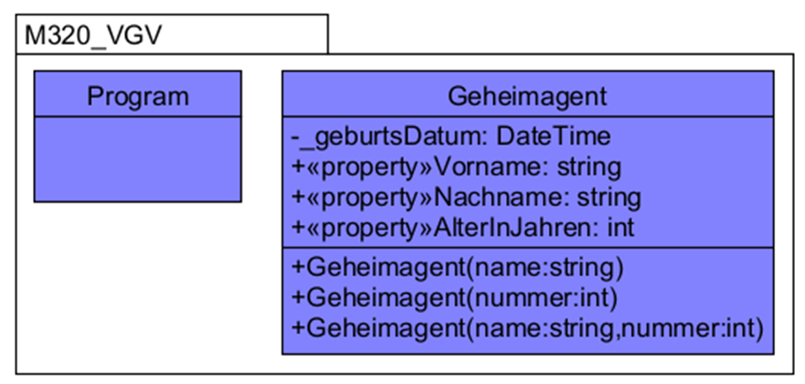

## Vererbung
Inhalt von: Files PR 4206 und LA 4208 & 4218

> Die Vererbung ermöglicht das Deklarieren neuer Klassen, welche bestehende Klassen wiederverwenden, erweitern, verbessern.

Bsp.: Es gibt verschiedene Fahrzeuge. Fahrzeuge beinhaltet Autos, Flugzeuge und Schiffe. Fahrzeuge ist in diese Beispiel eine Superklasse/Basisklasse der anderen Klassen. Auto, Flugzeuge und Schiffe sind Subklassen/abgeleitete Klassen. Oft sagt man, dass Subklassen von Superklassen erben. Man kann Superklassen auch Elternklassen und Subklassen Kinderklassen nennen.

### Generalisierung

Bei Vererbung wird auch oft der Begriff Generalisierung verwendet. Eine Superklasse ist die Generalisierung und die Subklassen sind Spezialisierungen der Superklasse.

Durch die Generalisierung muss man Verhalten, die bei allen Subklassen gleich sind, nur in der Superklasse implementieren. Die Subklassen vererben das automatisch. Dies erspart Zeit und Arbeit. Eine Klasse kann nur eine Spezialisierung von **einer** anderen Klasse sein.

Die einzelnen Elemente einer Klasse nennt man Member. Mit Member fasst man alle diese Dinge zusammen.

Dazu gehören: Felder, Eigenschaften, Konstruktoren, Methoden, Konstanten

### Vererbte Member

> Eine Subklasse erbt alle Member ihrer Superklasse mit Ausnahme der Konstruktoren. Die Subklasse erhält den gesamten Code
> der Superklasse (ausser den Konstruktoren). Sie müssen diesen nicht neu implementiern.

Der Subklasse können weitere Member (Felder, Eigenschaften, Methoden…) hinzugefügt werden, um das Verhalten und die Struktur der Superklasse zu erweitern oder verändern, bzw. zu spezialisieren. Methoden können auch überschrieben werden, sofern sie als virtual markiert sind.

### Vererbung Beispiel

```csharp
public class Fahrzeuge
{

}

// mit ": name der Superklasse" wird vererbt
public class Autos : Fahrzeuge
{

}
```

### Sichtbarkeit bei Vererbung

> Nicht alle vererbten Member können in der Subklasse verwendet werden, da die Sichtbarkeitsmodifikatoren bestehen bleiben

* Privat = immer noch nur in der eigenen Klasse sichtbar, Subklassen können diese **nicht** verwenden
* Public = kann von Subklassen verwendet werden, da sie von der eigenen und allen anderen Klassen verfügbar ist
* Protected = wenn man einen Member privat aber trotzdem zugrifflich für die Subklassen machen will muss diese protected sein

### Konstruktoren

* Wird ein Objekt einer Kindklasse instanziert, so wird als erstes der parameterlose Konstruktor der Elternklasse aufgerufen.
* Gibt es keinen Parameterlosen Konstruktor, so muss manuell ein Konstruktor der Basisklasse aufgerufen werden.
* Dies wird mit einem Doppelpunkt hinter dem Konstruktor und dann dem Aufruf des Konstruktors mit der Hilfe des Schlüsselworts base gemacht.

### Abstrakte und virtuelle Methoden

* Eine (potentielle) Superklasse kann Methoden mit dem Sichtbarkeitsmodifikator virtual deklarieren.
* Eine Subklasse kann diese Methode dann überschreiben. Dazu wird in der Signatur der überschreibenden Methode in der Subklasse der Modifikator override zwischen Sichtbarkeitsmodifikator und Typ des Rückgabewertes eingetragen.
* Mit dem Modifizierer abstract kann eine abstrakte Methode deklariert werden. Eine solche Methode hat keine Implementation und muss in allen nicht-abstrakten Subklassen implementiert werden.
* Damit eine abstrakte Methode deklariert werden kann, muss die entsprechende Klasse unter Verwendung des Schlüsselwortes
  abstract selber auch als abstrakt deklariert werden.
* Abstrakte und virtuelle Methoden sind wichtige Grundlagen für Polymorphie, das nähchste Thema, das wir anschauen werden.

### Die Super-Super-Klasse

> Die Klasse System.Object (die Klasse Object, welche im Namensraum System deklariert ist) ist die Superklasse von allen
> anderen Klassen, auch wenn dies nicht angegeben ist.

Fahrzeug, Geheimagent, Console oder DateTime sind alles Subklassen von Object.

In der Klasse System.Object sind einige Methoden definiert, welche durch die (implizite) Vererbung an alle anderen Klassen weitergegeben werden. Dazu zählen: .ToString() , .GetType() etc.

## Collections
Inhalt von: Files PR 4207 und LA 4210-4211

> Collections sind wie Array, aber flexibler. Sie haben eine flexible länge. Bei einer Collection können Sie zur Laufzeit neue Elemente einfügen (am Ende oder mittendrin) oder Elemente rauslöschen, ohne dass dabei leere Stellen entstehen. Es gibt verschieden Arten von collections: List, Dictionary, Queue etc.

Mit Collections kann man Sammlungen gleicher Objekte machen. Dies erlaubt uns bestimmte Arten von Assozationen zu bilden (Klassen kennen einander, "Has-A" beziehung: Human has-a pet).

### Implementation

```csharp
//Implementation bei List

//Deklaration/Initialisierung:
var farben = new List<string> {«rot», «grün», «blau»};

//Zugriff Element:
string farbe = farben[1];

//Iteration über alle Elemente:
foreach(string value in farben) 
{
Console.WriteLine(value);
}

//Element anfügen:
farben.Add(«gelb»);

//Element löschen:
farben.Remove(«blau»);

//Element ersetzen:
string[1] = «rosa»;

```

## Assoziatonen
Inhalt von: Files PR 4207 und LA 4210-4211

Schritt 1: Hier weiss man nur, dass diese sich kennen

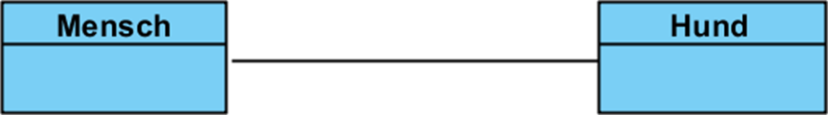

Schritt 2: Die Assoziation ist schon bestimmt, hier ist noch nicht klar wer der Besitzer ist.

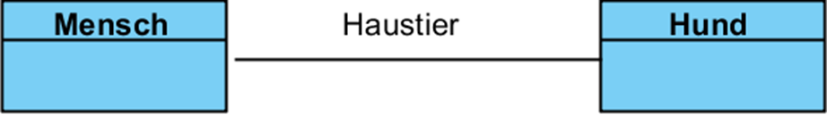

Schritt 3: Hund hat 1 Besitzer, Mensch kann beliebig viele Hunde haben.

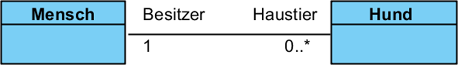

### Navigierbarkeit

Schritt 1: Man weiss nicht wer wen kennt.

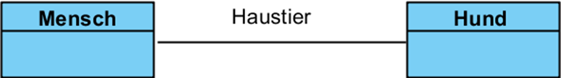

Schritt 2: Navigation von Mensch zu Hund erlaubt.

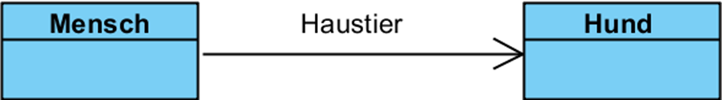

Schritt 3: Navigation **nur** von Mensch zu Hund erlaubt.

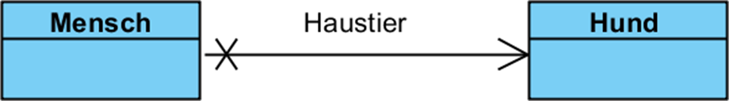

### Aggregation

> Die Aggregation eine spezielle Art der Assoziation: Sie zeigt Teile eines Ganzen (das Ganze «Has-A» Teil). Die Teil Objekte sind dabei unabhängig. Das heisst, sie können auch existieren, wenn sie vom Ganzen entfernt werden und beispielsweise einem anderen ganzen zugefügt werden.

Der Lernende ist ein Teil einer Schulklasse:

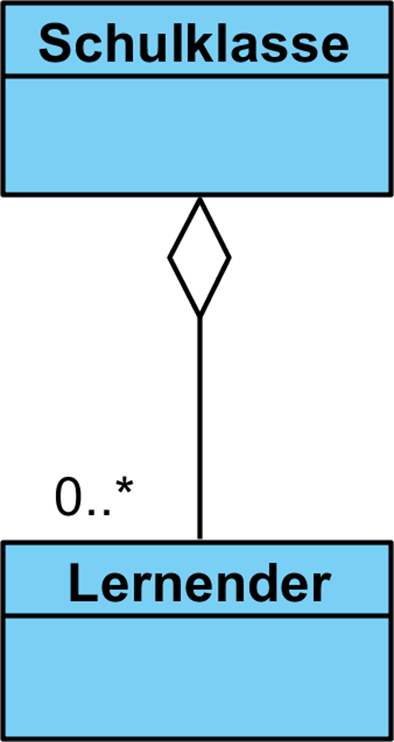

Ein Objekt der Klasse Lernender ist einem Objekt der Klasse «Klasse» zugeordnet:

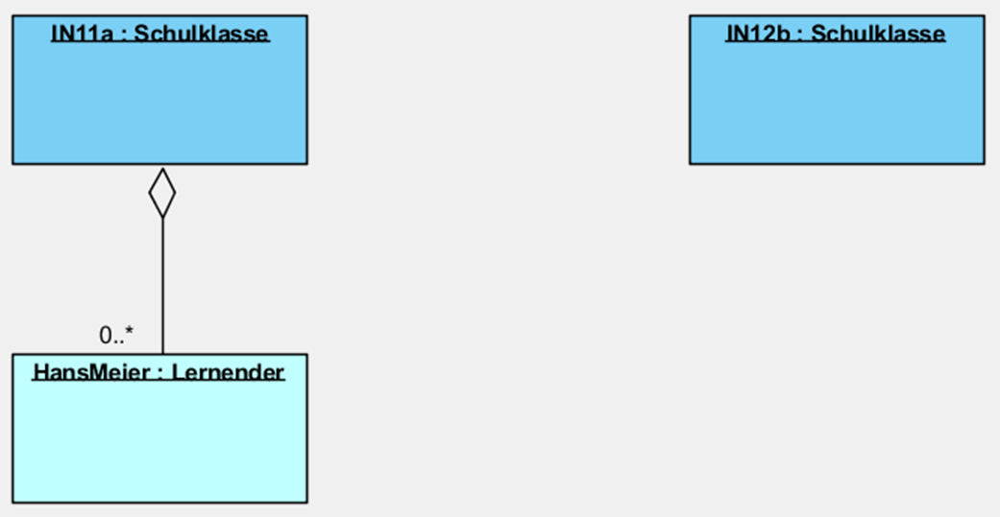

Unabhängigkeit: Bei einer Aggregation kann der Lernende ev. aber auch alleine im System sein. Beispielsweise, wenn er noch keine zugeordneten Klassen hat.

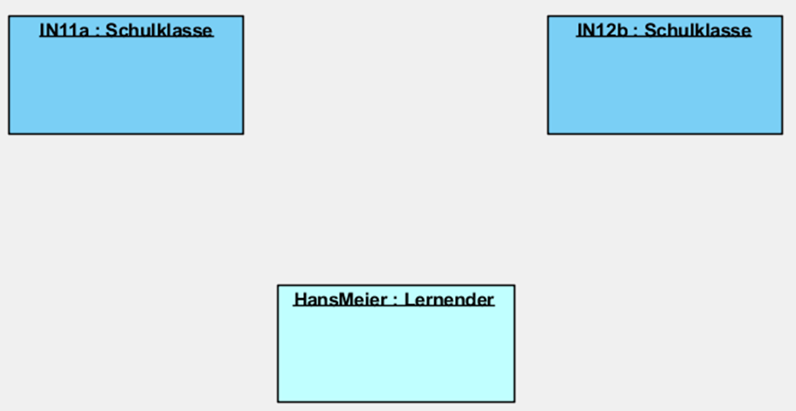

Der/die Lernende kann auch einem anderen Schulklassen-Objekt zugeordnet werden.

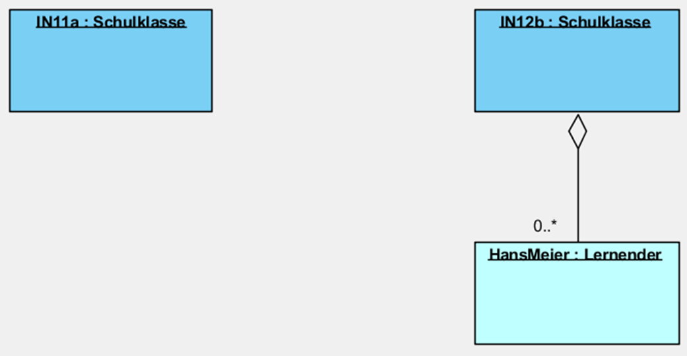

### Komposition

> Die Komposition ist eine starke Form der Aggregation: Das Ganze und seine Teile sind dabei untrennbar miteinander verbunden. Wird bei einer Komposition „das Ganze“ gelöscht, müssen auch seine Teile gelöscht werden, weil die Teile nicht alleine existieren können. Die Multiplizität auf der Seite des Ganzen ist immer 1.

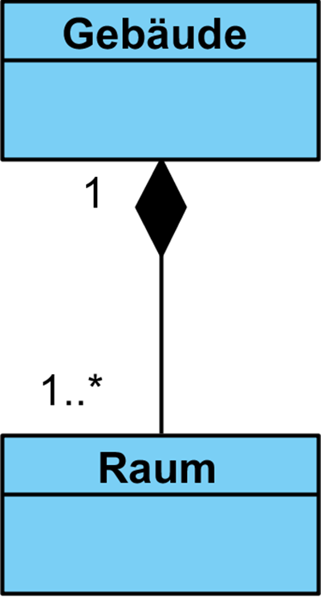

## Polymorphus
Inhalt von: Files PR 4208 und LA 4212

> Ein Flugzeug IS-A Fahrzeug. Der Flugzeug kann alles, was ein Fahrzeug kann (und mehr). Ein Auto IS-A Fahrzeug, etc.
>
> Sie haben ein Objekt, das mit einem Fahrzeug arbeiten will. Es ist aber egal, welches Fahrzeug, das Objekt muss nicht mal welches Fahrzeug es ist.

Wenn ein Objekt mit Fahrzeugen arbeiten kann, kann es auch mit allen Kinderklassen von «Fahrzeugen» arbeiten, ohne diese zu kennen. Da es nur "Fahrezuge" kennen muss, heisst es das: **Eine Variable vom Typ einer Klasse kann auch alle Kinder dieser Klasse aufnehmen.**

### Implementation

**Polymorphismus:**

Fahrzeug f2 = new Jet();

Fahrzeug f1 = new Fahrzeug();

In f1 und f2 können nun ausschliesslich die Methoden aufgerufen werden, die auch von Fahrzeug unterstützt werden (denn wenn auch die Methoden von Jet aufgerufen werden könnten, würde der Code ungültig, in dem Moment, wo wir bspw. ein Objekt der Klasse Schiff in der Variablen ablegen würden.

Wenn wir eine virtuelle Methode der Klasse Fahrzeug aufrufen, wird die entsprechende overridete Methode der eigentlichen Klasse des Objekts aufgerufen. Bspw. würde f2.Fortbewegen() die Fortbewegen-Method der Klasse Jet inklusive Abheben und Landen aufrufen.

### UML Beispiel

Wir programmieren ein einfaches Computerspiel mit Monstern (Prinzessin, Riesenfrosch und Schlange). Jedes von diesen Monstern hate eine Art, sich zu bewegen, sie greifen auch auf unterschiedlicher Weise an. Pro Runde darf jedes Monster sich ein Mal bewegen und einmal angreifen.

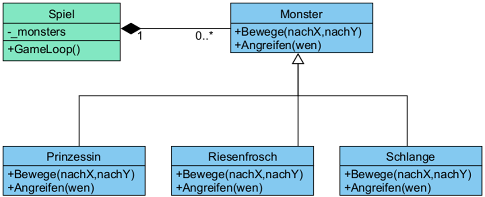

Wenn ein neues Monster instanziert wird, so wird es der Collection «_monsters» in der Klasse «Spiel» hinzugefügt.

Die Klasse «Spiel» kennt nur Objekte der Klasse Monster: Es interessiert sich nicht dafür, ob dies Frösche, Schlangen oder Prinzessinnen sind. Für das Spiel reicht das vollkommen aus.

Das Spiel lässt dann jedes Monster einmal pro Runde sich bewegen und angreifen. Dadurch werden die jeweiligen Methoden der effektiven Kindklassen aufgerufen, und jedes Monster bewegt sich und greift an wie vorgesehen.

### Vorteile

Build for Change: In Version 2.0 des Spiels gibt es einen DLC und es kommen noch Drachen und Ninjas hinzu.

Solange diese neuen Klassen Subklassen von «Monster» sind, brauchen die Klasse «Spiel» und der «GameLoop()» nicht angepasst zu werden.

Man erreicht so «Loose Coupling»

* Klassen müssen sich nicht genau kennen: Die Klasse Spiel muss nicht wissen, was genau innerhalb von Prinzessin oder Schlange vor sich geht. Bloss, dass diese sich bewegen und angreifen können.
* Daraus ergibt sich eine geringere Komplexität, weil das Verhalten der Objekte schön von einander getrennt ist und nicht ineinandergreift.
* Auch hängt das Programm «lockerer» zusammen: Klassen können ausgetauscht werden, Änderungen und Fehler haben kleineren Auswirkungen

### Implementation

```csharp
public void GameLoop()
{
    bool spielLaeuft = true;
    while(spielLaeuft)
    {
        // Dinge und Events 
        foreach (Monster monster in _monsters)
        {
            monster.Bewege(toX, toY);
            if (spielerDa)
            {
                monster.Angreifen(spieler);
            }
        }
    }
    // Aufraeumen 
}
```

## UML Sequnezdiagramme
Inhalt von: Files PR 4210 und LA 4216

> Sequenzdiagramme gehören zur Gruppe den Interaktionsdiagrammen und zeigen als solche, wie Komponenten zusammenarbeiten. Mit Sequenzdiagrammen werden Ausschnitte aus dem Programmablauf dokumentiert (nicht bzw. sehr selten das gesamte Programm). Sie zeigen wichtige oder komplexe Abläufe, die ohne eine zusätzliche grafische Hilfestellung schwer zu verstehen wären. Sequenzdiagramme arbeiten mit Objekten und sind darum eine gute Ergänzung zu den Klassendiagrammen.

### Problem am Klassendiagramm

Das Klassendiagramm ist statisch. Es sagt nicht viel über das Zusammenspiel der Klassen und das Laufzeitverhalten. Wie ein Ablauf vor sich geht ist hier nicht zu erkennen.

Einzelne Aufrufe sind nicht explizit zu erkennen.

### Beispiel Sequenzdiagramm

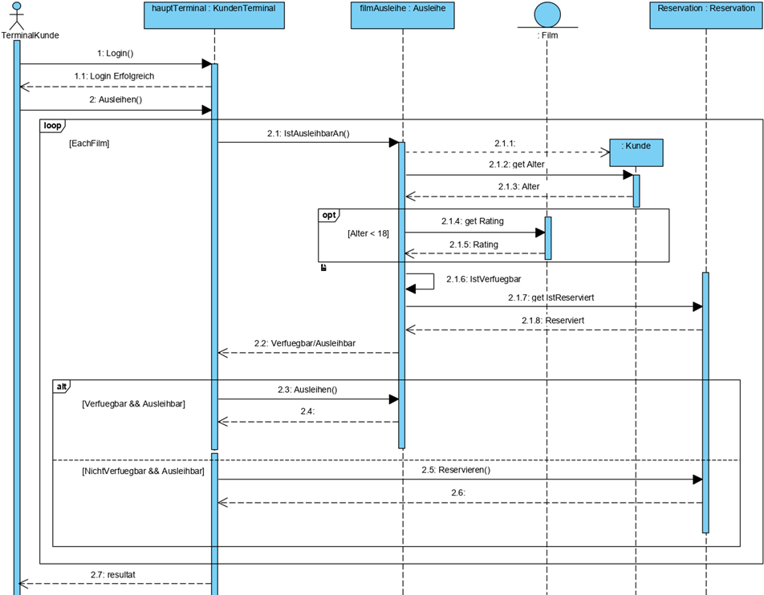

#### Beteiligte Objekte

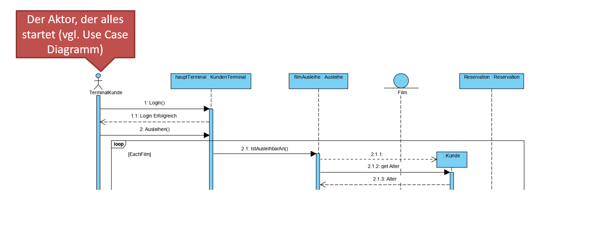

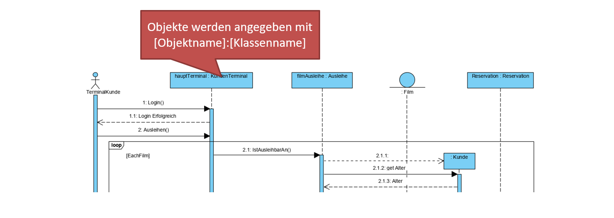

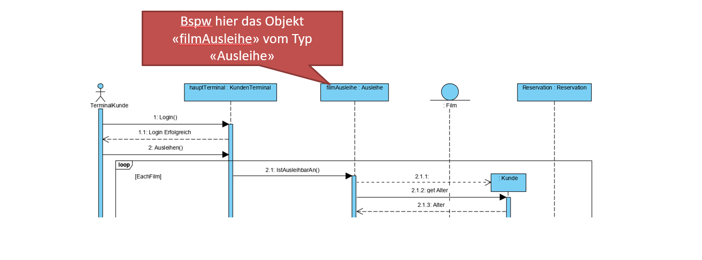

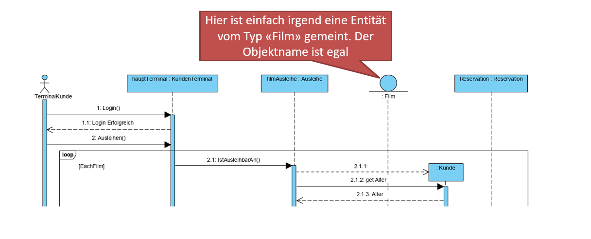

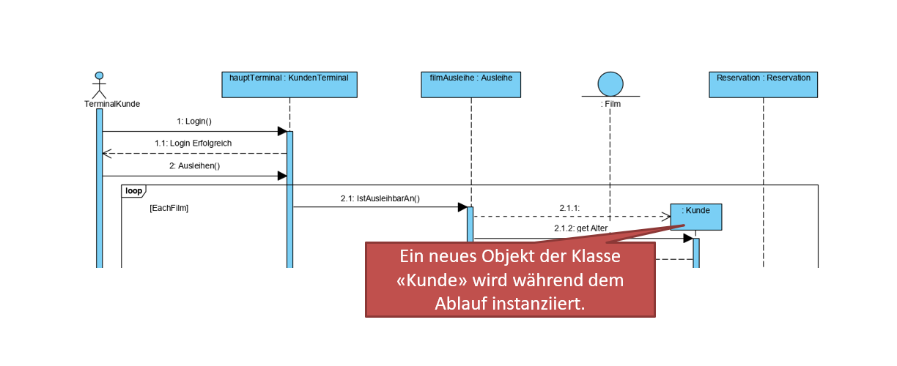

#### Zeit

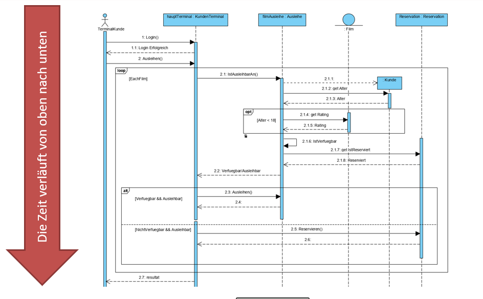

#### Lebenslinien

Die Lebenslinie zeigt an, wann ein Objekt «lebt». Damit ist gemeint, wann es existiert. Dies beginnt mit der Instanziierung.

Die Lebenslinie ist gestrichelt zu den Zeitpunkten, an denen das Objekt keine Aufgaben hat. Zu dieser Zeit ist es nicht relevant, ob es existiert oder nicht.

Nur wenn die Linie voll ist, muss das Objekt zwingend existieren.

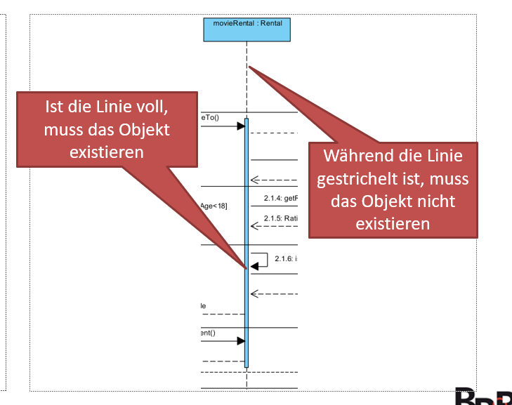

#### Methodenaufrud und Rückgabe

Interaktionen zwischen den Objekten werden mit Pfeilen eingezeichnet.

Dazu gehören: Methodenaufrufe, Rückgabewerte (= Antworten), Eigenschaftszugriffe, Instanziierungen (bspw new Kunde())

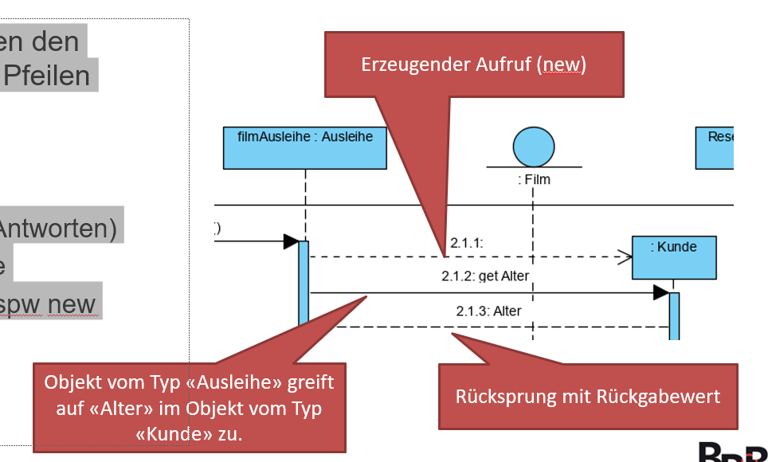

#### Frames: Loop

Schleifen werden als Boxen (Frames) eingezeichnet, die alles umfassen, was wiederholt werden soll.

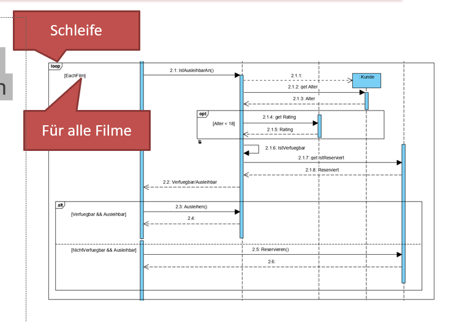

#### Frames: Opt

Der Opt-Frame wird eingesetzt, um Abläufe zu markieren, die nur unter gewissen Voraussetzungen ausgeführt werden.

Hier wird bspw. der Zugriff auf das  Rating des Films nur gemacht, wenn das Alter des Kunden/der Kundin unter 18 Jahren ist.

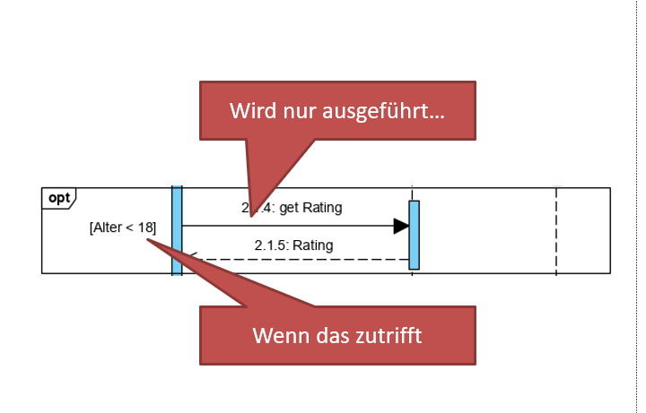

#### Frames: Alt

Gibt es alternative Abläufe (if/else bzw switch), wird der Alt-Frame eingesetzt.

Hier werden verschiedene Alternativen durch eine gestrichelte Linie getrennt.

Links steht jeweils in eckigen Klammern, unter welchen Umständen diese Option ausgeführt wird.


